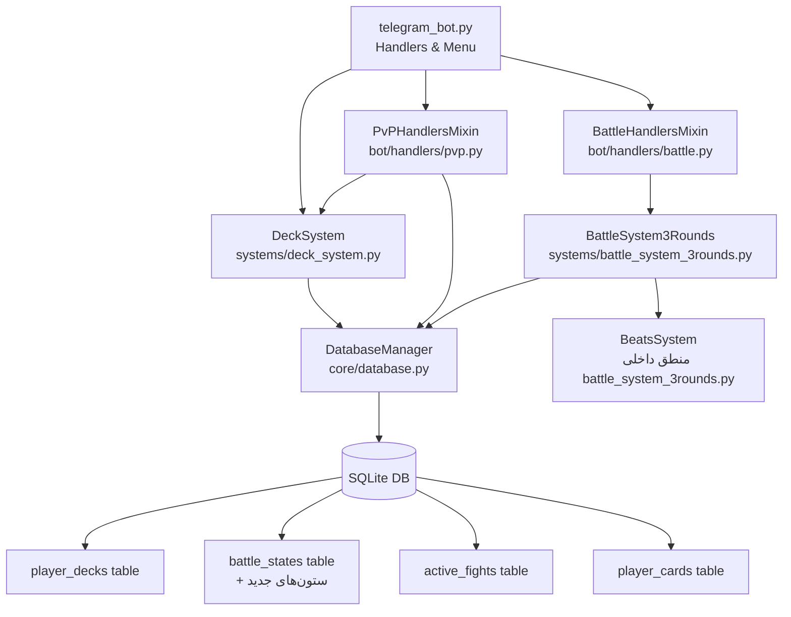
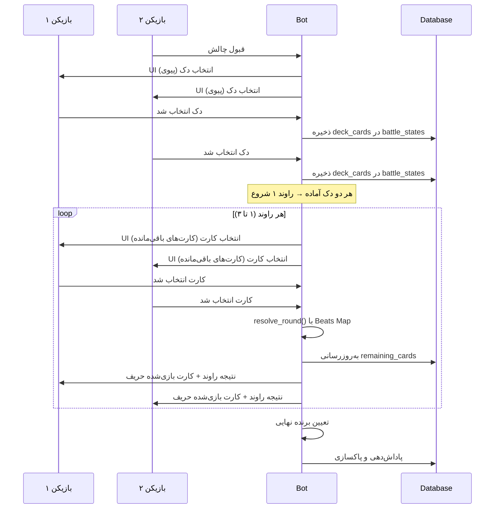

# سند طراحی: سیستم دک و نقشه برتری (TelBattle Deck & Beats Map)

## ۱. مرور کلی (Overview)

این طراحی دو فاز بعدی TelBattle را پوشش می‌دهد:

**فاز ۱ — سیستم دک:** هر بازیکن می‌تواند تا ۳ دک ۳ کارته از کلکسیون خود بسازد و ذخیره کند. قبل از هر فایت یک دک انتخاب می‌شود و در هر راوند بازیکن یکی از کارت‌های باقی‌مانده دکش را بازی می‌کند.

**فاز ۲ — نقشه برتری (Beats Map):** سیستم TYPE_COUNTER قدیمی کاملاً حذف می‌شود. در زمان resolve هر راوند، صفت غالب (dominant attribute) هر کارت بر اساس بیشترین مقدار پس از اعمال boost زمین محاسبه می‌شود. اگر یکی از دو کارت در چرخه برتری بر دیگری برتر باشد، بدون توجه به مجموع امتیاز برنده است.

### محدوده خارج از این فاز
- افکت‌های خاص کارت (Reflect، Drain، Arena Shift)
- سیستم stat locking (حذف شده — در این فاز کارت کامل انتخاب می‌شود، نه stat منفرد)

---

## ۲. معماری (Architecture)



### جریان اصلی فایت با دک



---

## ۳. مدل‌های داده (Data Models)

### ۳.۱ جدول جدید: `player_decks`

```sql
CREATE TABLE IF NOT EXISTS player_decks (
    deck_id    TEXT PRIMARY KEY,          -- UUID
    player_id  INTEGER NOT NULL,
    deck_name  TEXT NOT NULL,             -- حداکثر ۲۰ کاراکتر
    card_id_1  TEXT NOT NULL,             -- card_id کارت اول
    card_id_2  TEXT NOT NULL,             -- card_id کارت دوم
    card_id_3  TEXT NOT NULL,             -- card_id کارت سوم
    is_valid   INTEGER NOT NULL DEFAULT 1, -- 0 اگر یک کارت از کلکسیون حذف شده
    created_at TEXT NOT NULL,
    updated_at TEXT NOT NULL,
    FOREIGN KEY (player_id) REFERENCES players (user_id)
);
CREATE INDEX IF NOT EXISTS idx_player_decks_player
    ON player_decks (player_id);
```

**قوانین یکپارچگی:**
- تعداد سطرها برای یک `player_id` هرگز از ۳ تجاوز نمی‌کند (enforced در DeckSystem)
- `card_id_1 != card_id_2 != card_id_3` (enforced در DeckSystem)
- هر سه card_id باید در جدول `player_cards` با همان `player_id` وجود داشته باشند

### ۳.۲ تغییرات در جدول `battle_states`

ستون‌های جدید به جدول موجود اضافه می‌شوند:

```sql
ALTER TABLE battle_states ADD COLUMN challenger_deck_cards TEXT DEFAULT '[]';
-- JSON آرایه از card_id های دک challenger: ["id1","id2","id3"]

ALTER TABLE battle_states ADD COLUMN opponent_deck_cards TEXT DEFAULT '[]';
-- JSON آرایه از card_id های دک opponent: ["id1","id2","id3"]

ALTER TABLE battle_states ADD COLUMN challenger_remaining_cards TEXT DEFAULT '[]';
-- کارت‌های باقی‌مانده challenger که هنوز بازی نشده‌اند

ALTER TABLE battle_states ADD COLUMN opponent_remaining_cards TEXT DEFAULT '[]';
-- کارت‌های باقی‌مانده opponent که هنوز بازی نشده‌اند

ALTER TABLE battle_states ADD COLUMN challenger_deck_selected INTEGER DEFAULT 0;
-- 1 اگر challenger دکش را انتخاب کرده

ALTER TABLE battle_states ADD COLUMN opponent_deck_selected INTEGER DEFAULT 0;
-- 1 اگر opponent دکش را انتخاب کرده
```

**توجه:** ستون‌های `challenger_used_stats`، `opponent_used_stats` دیگر برای stat locking استفاده نمی‌شوند. کارت‌های بازی‌شده از `remaining_cards` خوانده می‌شوند.

### ۳.۳ تغییرات در جدول `active_fights`

```sql
ALTER TABLE active_fights ADD COLUMN challenger_deck_id TEXT DEFAULT NULL;
-- deck_id انتخاب‌شده توسط challenger

ALTER TABLE active_fights ADD COLUMN opponent_deck_id TEXT DEFAULT NULL;
-- deck_id انتخاب‌شده توسط opponent
```

---

## ۴. طراحی کامپوننت‌ها (Components and Interfaces)

### ۴.۱ فایل جدید: `systems/deck_system.py`

```python
class DeckSystem:
    MAX_DECKS = 3
    MAX_CARDS_PER_DECK = 3
    MAX_NAME_LENGTH = 20

    def __init__(self, db: DatabaseManager): ...

    def get_player_decks(self, player_id: int) -> List[Dict]: ...
    # برمی‌گرداند: [{"deck_id":..., "deck_name":...,
    #                "cards":[Card, Card, Card], "is_valid": bool}]

    def create_deck(self, player_id: int, card_ids: List[str],
                    name: str = None) -> Tuple[bool, str]:
    # خروجی: (success, error_message)
    # اعتبارسنجی: تعداد دک، تکراری نبودن، عضویت در کلکسیون
    ...

    def update_deck(self, player_id: int, deck_id: str,
                    card_ids: List[str] = None,
                    name: str = None) -> Tuple[bool, str]: ...

    def delete_deck(self, player_id: int, deck_id: str) -> Tuple[bool, str]: ...

    def get_deck_by_id(self, deck_id: str) -> Optional[Dict]: ...

    def get_valid_decks(self, player_id: int) -> List[Dict]:
    # فقط دک‌های کامل و معتبر (is_valid=1)
    ...

    def validate_deck_integrity(self, player_id: int, deck_id: str) -> bool:
    # بررسی می‌کند که هر ۳ کارت هنوز در کلکسیون وجود دارند
    # در صورت ناقص بودن، is_valid = 0 می‌کند
    ...

    def _generate_default_name(self, player_id: int) -> str:
    # «دک ۱»، «دک ۲»، «دک ۳» بر اساس تعداد موجود
    ...
```

**اعتبارسنجی در `create_deck`:**
1. تعداد دک فعلی بازیکن باید کمتر از `MAX_DECKS` (3) باشد
2. `card_ids` باید دقیقاً ۳ عنصر داشته باشد
3. هیچ card_id تکراری نداشته باشد
4. هر card_id باید در `player_cards` با همان `player_id` وجود داشته باشد
5. نام حداکثر ۲۰ کاراکتر (اگر داده شده)
6. اگر نام داده نشده، نام پیش‌فرض تعیین می‌شود

### ۴.۲ تغییرات در `core/database.py`

متدهای جدید به `DatabaseManager` اضافه می‌شوند:

```python
# ---- Deck CRUD ----
def create_deck(self, player_id, deck_name, card_id_1, card_id_2, card_id_3) -> str
    # deck_id جدید برمی‌گرداند

def get_player_decks(self, player_id: int) -> List[Dict]
def get_deck_by_id(self, deck_id: str) -> Optional[Dict]
def update_deck(self, deck_id, deck_name=None, card_id_1=None,
                card_id_2=None, card_id_3=None, is_valid=None) -> bool
def delete_deck(self, deck_id: str) -> bool
def count_player_decks(self, player_id: int) -> int

# ---- Fight state با دک ----
def set_fight_deck(self, fight_id: str, role: str, deck_id: str) -> bool
    # role: 'challenger' یا 'opponent'
    # deck_id را در active_fights ذخیره می‌کند

def update_battle_deck_state(self, fight_id: str, role: str,
                              remaining_cards: List[str],
                              selected: bool = None) -> bool
    # remaining_cards را JSON می‌کند و در battle_states به‌روز می‌کند
```

### ۴.۳ تغییرات در `systems/battle_system_3rounds.py`

**حذف:**
```python
TYPE_COUNTER = {...}       # حذف کامل
TYPE_COUNTER_BONUS = 10    # حذف کامل
```

**اضافه/جایگزین:**
```python
# نقشه برتری جدید
BEATS_MAP = {
    "speed":      "power",       # speed بر power برتری دارد
    "power":      "popularity",  # power بر popularity برتری دارد
    "popularity": "iq",          # popularity بر iq برتری دارد
    "iq":         "speed",       # iq بر speed برتری دارد
}

# ترتیب اولویت برای تساوی امتیاز
DOMINANT_PRIORITY = ["power", "speed", "iq", "popularity"]

def get_dominant_attr(card: Card, arena: str, arena_boost_applied: bool = True) -> str:
    """
    محاسبه صفت غالب کارت پس از اعمال boost زمین.
    card_type ذخیره‌شده نادیده گرفته می‌شود.
    """
    stats = {
        "power":      card.power,
        "speed":      card.speed,
        "iq":         card.iq,
        "popularity": card.popularity
    }
    if arena_boost_applied:
        arena_info = ARENAS.get(arena, {})
        boost_stat   = arena_info.get("boost_stat")
        boost_amount = arena_info.get("boost_amount", 0)
        if boost_stat and boost_stat in stats:
            stats[boost_stat] += boost_amount

    # پیدا کردن بالاترین مقدار
    max_val = max(stats.values())
    # اگر تساوی: اولویت DOMINANT_PRIORITY
    for attr in DOMINANT_PRIORITY:
        if stats[attr] == max_val:
            return attr

def beats(attr_a: str, attr_b: str) -> bool:
    """True اگر attr_a بر attr_b برتری داشته باشد."""
    return BEATS_MAP.get(attr_a) == attr_b
```

**تغییر در `resolve_round`:**
```
قبل از مقایسه مجموع:
  dom_ch = get_dominant_attr(challenger_card, arena)
  dom_op = get_dominant_attr(opponent_card, arena)

  if beats(dom_ch, dom_op):
      winner = "challenger"
      beats_win = True
  elif beats(dom_op, dom_ch):
      winner = "opponent"
      beats_win = True
  else:
      # fallback به مجموع امتیاز
      winner = "challenger" if ch_total > op_total else
               "opponent"   if op_total > ch_total else None
      beats_win = False
```

**تغییر در `BattleState`:**
- `challenger_used_stats` و `opponent_used_stats` ← تبدیل به `challenger_used_cards` و `opponent_used_cards` (list of card_id)
- اضافه شدن فیلد `beats_win: bool` به `RoundResult`

### ۴.۴ تغییرات در `bot/handlers/battle.py`

**حذف:** `_send_round_stat_selection()` و `r3_stat_select_handler()`

**اضافه:**
```python
async def _send_round_card_selection(
    context, fight_id, user_id, remaining_card_ids, arena_id, round_num
):
    """UI انتخاب کارت برای راوند جاری — نمایش کارت‌های باقی‌مانده"""
    # هر دکمه: نام کارت + kمیابی + dominant attr پیش‌بینی‌شده
    # callback_data: "r3_card_{fight_id}_{card_id}"

async def r3_card_select_handler(update, context):
    """کاربر یک کارت برای راوند انتخاب کرد"""
    # ذخیره موقت: context.bot_data[f"r3_{fight_id}_{role}_card"] = card_id
    # اگر هر دو انتخاب کردند: _resolve_3round() فراخوانی شود
```

**تغییر `_resolve_3round`:**
- به جای `ch_stat` / `op_stat`، حالا `ch_card_id` / `op_card_id` دریافت می‌کند
- منطق TYPE_COUNTER حذف و منطق BEATS_MAP جایگزین می‌شود
- `remaining_cards` هر بازیکن در DB به‌روز می‌شود
- پس از resolve: نام کارت بازی‌شده حریف + kمیابی + dominant attr او آشکار می‌شود

### ۴.۵ تغییرات در `bot/handlers/pvp.py`

**تغییر `accept_pvp_fight_handler`:**
- به جای ارسال `_create_pvp_card_selection_keyboard` (انتخاب کارت منفرد)، حالا `_create_deck_selection_keyboard` ارسال می‌شود

**اضافه:**
```python
async def _send_deck_selection(context, fight_id, user_id):
    """ارسال UI انتخاب دک در پیوی"""

async def pvp_deck_select_handler(update, context):
    """کاربر دک را قبل از فایت انتخاب کرد"""
    # callback_data: "pvp_deck_{fight_id}_{deck_id}"
    # بررسی هر دو بازیکن — اگر هر دو انتخاب کردند: _init_3round_battle فراخوانی
```

### ۴.۶ تغییرات در `telegram_bot.py`

اضافه کردن به منوی اصلی:
```
🗂️ دک‌های من  →  deck_menu callback
```

Handler های جدید ثبت می‌شوند:
- `deck_menu` — نمایش لیست دک‌ها
- `deck_create` — شروع فرآیند ساخت دک
- `deck_edit_{deck_id}` — ویرایش دک
- `deck_delete_{deck_id}` — حذف دک (با تأیید)
- `pvp_deck_{fight_id}_{deck_id}` — انتخاب دک برای فایت
- `r3_card_{fight_id}_{card_id}` — انتخاب کارت در راوند

---

## ۵. جریان رابط کاربری (UI Flow)

### ۵.۱ منوی مدیریت دک

```
/start → منوی اصلی
  └── 🗂️ دک‌های من
        ├── [لیست دک‌ها با نام و وضعیت]
        │     ├── 📋 دک ۱: "کشتار" — ✅ کامل
        │     │     → نمایش جزئیات + دکمه‌های ویرایش / حذف
        │     ├── 📋 دک ۲: "سرعت" — ✅ کامل
        │     └── 📋 دک ۳: "دفاعی" — ⚠️ ناقص
        └── ➕ ساخت دک جدید
              Step 1: انتخاب کارت اول (مرور کلکسیون)
              Step 2: انتخاب کارت دوم (کارت اول نمایش داده می‌شود)
              Step 3: انتخاب کارت سوم
              Step 4: وارد کردن نام (اختیاری)
              → تأیید و ذخیره
```

**Inline keyboard برای ساخت دک:**
```
کارت اول را انتخاب کنید:
[🟡 Legendary (X)]
[🟣 Epic (X)]
[🟢 Normal (X)]

(پس از انتخاب دسته، لیست کارت‌ها با pagination نمایش)
[Arthur Morgan  — Legend  ⚡💪🧠❤️]
[Batman         — Epic    ...]
...
[◀️ قبلی]  [بعدی ▶️]
[🔙 بازگشت]
```

### ۵.۲ انتخاب دک قبل از فایت (پیوی)

```
✅ رقیب پذیرفت!

🗂️ کدام دک می‌خواهی بازی کنی؟

[🃏 کشتار — Arthur, Batman, Speed_X]
[🃏 سرعت — ...]
[➕ ساخت دک جدید]
```

### ۵.۳ انتخاب کارت در هر راوند (پیوی)

```
⚔️ راوند ۲

🏟️ زمین: ⚡ پیست سرعت

کارت‌های باقی‌مانده تو:
[🟡 Arthur Morgan  — ⚡ سرعت غالب — 320 امتیاز]
[🟣 Batman         — 💪 قدرت غالب  — 280 امتیاز]

🔍 حریف: ??? (دو کارت باقی مانده)
```

### ۵.۴ نتیجه راوند (پس از resolve)

```
⚔️ راوند ۲ تموم شد!

🎴 تو: Arthur Morgan (🟡) — صفت غالب: ⚡ سرعت
🎴 حریف: Albert Wesker (🟣) — صفت غالب: 💪 قدرت

🔥 برتری: سرعت بر قدرت!
✅ تو بردی این راوند!

امتیاز: تو ۲ — حریف ۰
```

---

## ۶. الگوریتم‌های کلیدی (Key Algorithms)

### ۶.۱ الگوریتم Beats Map

```
تابع get_dominant_attr(card, arena):
    stats = {
        power:      card.power,
        speed:      card.speed,
        iq:         card.iq,
        popularity: card.popularity
    }
    اگر arena وجود داشت:
        boost_stat = ARENAS[arena]["boost_stat"]
        stats[boost_stat] += ARENAS[arena]["boost_amount"]

    max_val = max(stats.values())
    برای هر attr در [power, speed, iq, popularity]:  # ترتیب اولویت
        اگر stats[attr] == max_val:
            return attr

تابع resolve_round_beats(ch_card, op_card, arena, ch_total, op_total):
    dom_ch = get_dominant_attr(ch_card, arena)
    dom_op = get_dominant_attr(op_card, arena)

    اگر BEATS_MAP[dom_ch] == dom_op:
        return ("challenger", True)   # challenger با برتری برنده
    اگر BEATS_MAP[dom_op] == dom_ch:
        return ("opponent", True)     # opponent با برتری برنده
    اگر ch_total > op_total:
        return ("challenger", False)  # برنده با مجموع
    اگر op_total > ch_total:
        return ("opponent", False)    # برنده با مجموع
    return (None, False)              # تساوی
```

**چرخه برتری:**
```
speed → power → popularity → iq → speed (چرخه‌ای)
```

### ۶.۲ الگوریتم اعتبارسنجی دک

```
تابع validate_deck(player_id, card_ids, name):
    اگر count_player_decks(player_id) >= 3:
        return خطا: "حداکثر ۳ دک مجاز است"
    اگر len(card_ids) != 3:
        return خطا: "دک باید دقیقاً ۳ کارت داشته باشد"
    اگر len(set(card_ids)) != 3:
        return خطا: "کارت‌های تکراری مجاز نیست"
    برای هر card_id در card_ids:
        اگر card_id در کلکسیون player_id نبود:
            return خطا: "کارت {card_id} در کلکسیون شما نیست"
    اگر name و len(name) > 20:
        return خطا: "نام دک حداکثر ۲۰ کاراکتر"
    return موفق
```

### ۶.۳ منطق انتخاب خودکار کارت آخر

```
تابع get_available_deck_cards(remaining_cards):
    اگر len(remaining_cards) == 1:
        auto_select = remaining_cards[0]
        return ([], auto_select)   # لیست خالی + auto-selected
    return (remaining_cards, None)
```

### ۶.۴ منطق هماهنگی انتخاب (Sync Logic)

هر بار که یک بازیکن دک یا کارت انتخاب می‌کند:

```
مرحله انتخاب دک:
  ذخیره در DB: flag challenger_deck_selected / opponent_deck_selected
  اگر هر دو flag = 1:
      _init_3round_battle() فراخوانی شود

مرحله انتخاب کارت راوند:
  ذخیره موقت در context.bot_data[f"r3_{fight_id}_{role}_card"]
  اگر هر دو role کارت داشتند:
      _resolve_3round() فراخوانی شود
```

---

## ۷. خواص صحت (Correctness Properties)

*یک property ویژگی یا رفتاری است که باید در تمام اجراهای معتبر سیستم صادق باشد — در واقع یک اظهاریه رسمی درباره آنچه سیستم باید انجام دهد. Property‌ها پل بین مشخصات خوانای انسانی و تضمین‌های صحت قابل بررسی ماشینی هستند.*

### Property 1: ثابت بودن تعداد دک‌ها

*برای هر* بازیکن، تعداد دک‌های ذخیره‌شده‌اش هرگز از ۳ تجاوز نمی‌کند.

**Validates: Requirements 1.1**

---

### Property 2: اندازه دک دقیقاً ۳ کارت

*برای هر* دکی که با موفقیت ذخیره شده، تعداد کارت‌های آن دقیقاً ۳ است.

**Validates: Requirements 1.2**

---

### Property 3: بی‌تکراری کارت‌های دک

*برای هر* دک معتبر، هیچ دو card_id یکسانی در آن وجود ندارد (هر سه card_id منحصربه‌فرد هستند).

**Validates: Requirements 1.4**

---

### Property 4: اعتبارسنجی طول نام دک

*برای هر* نام دلخواه:
- اگر طول نام بیشتر از ۲۰ کاراکتر باشد → عملیات ساخت/ویرایش رد می‌شود
- اگر طول نام حداکثر ۲۰ کاراکتر باشد → پذیرفته می‌شود

**Validates: Requirements 1.5**

---

### Property 5: حذف دک — اثر پاک‌سازی

*برای هر* دکی که ساخته و سپس حذف شده، آن دک دیگر در لیست `get_player_decks()` ظاهر نمی‌شود.

**Validates: Requirements 1.8**

---

### Property 6: دک ناقص پس از حذف کارت

*برای هر* دکی که حداقل یکی از کارت‌هایش از کلکسیون بازیکن حذف شده باشد، وضعیت آن دک به `is_valid = 0` تغییر می‌کند.

**Validates: Requirements 1.9**

---

### Property 7: فیلتر دک‌های کامل در UI فایت

*برای هر* بازیکنی با ترکیبی از دک‌های کامل و ناقص، `get_valid_decks()` فقط دک‌هایی با `is_valid = 1` برمی‌گرداند.

**Validates: Requirements 3.2**

---

### Property 8: ذخیره‌سازی کارت‌های دک در battle_state — Round-Trip

*برای هر* دکی که یک بازیکن قبل از فایت انتخاب می‌کند، سه card_id ذخیره‌شده در `battle_states.remaining_cards` دقیقاً با card_id های آن دک برابر است.

**Validates: Requirements 3.4**

---

### Property 9: کاهش remaining_cards پس از انتخاب کارت

*برای هر* وضعیت فایت با N کارت باقی‌مانده، پس از انتخاب یک کارت:
- تعداد باقی‌مانده N-1 می‌شود
- کارت انتخاب‌شده دیگر در لیست باقی‌مانده نیست

**Validates: Requirements 4.2, 4.3**

---

### Property 10: محاسبه صحیح dominant attribute

*برای هر* کارت با هر ترکیبی از مقادیر stats و هر زمین بازی، `get_dominant_attr()` صفتی را برمی‌گرداند که بیشترین مقدار را پس از اعمال boost دارد — با اولویت‌بندی `power > speed > iq > popularity` در صورت تساوی.

**Validates: Requirements 5.1, 5.2, 5.3, 5.4**

---

### Property 11: برتری Beats Map در resolve راوند

*برای هر* جفت کارتی که `dom_A` بر `dom_B` برتری داشته باشد (یعنی `BEATS_MAP[dom_A] == dom_B`)، کارت A برنده راوند است صرف‌نظر از اینکه مجموع امتیاز کارت B بیشتر باشد.

**Validates: Requirements 6.2**

---

### Property 12: Fallback به مجموع در غیاب برتری

*برای هر* جفت کارتی که نه `BEATS_MAP[dom_A] == dom_B` و نه `BEATS_MAP[dom_B] == dom_A` صادق باشد (یا هر دو dominant یکسان باشند)، برنده راوند کارتی است که مجموع امتیاز بالاتری دارد (یا تساوی اگر برابر باشند).

**Validates: Requirements 6.3**

---

## ۸. مدیریت خطا (Error Handling)

### ۸.۱ خطاهای سیستم دک

| موقعیت | رفتار مورد انتظار |
|---|---|
| ساخت دک چهارم | پیغام خطا: «حداکثر ۳ دک مجاز است» — عملیات لغو |
| کارت تکراری در دک | پیغام خطا: «این کارت را قبلاً انتخاب کردی» |
| کارت‌ای که متعلق به بازیکن نیست | پیغام خطا: «این کارت در کلکسیون شما نیست» |
| نام بیش از ۲۰ کاراکتر | پیغام خطا: «نام حداکثر ۲۰ کاراکتر» |
| دک ناقص در زمان انتخاب فایت | دک در لیست نمایش داده نمی‌شود |

### ۸.۲ خطاهای فایت

| موقعیت | رفتار مورد انتظار |
|---|---|
| بازیکن هیچ دک کاملی ندارد | نمایش دکمه «ساخت دک فوری» |
| timeout قبل از انتخاب دک | فایت لغو + پاکسازی battle_state |
| کارت انتخاب‌شده در remaining نیست | query.answer با پیغام خطا — انتخاب لغو |
| کارت‌های هر دو بازیکن در راوند یکسان است | مجاز است — resolve مستقل هر کارت |
| از دست دادن context.bot_data بعد از restart | fallback: بارگذاری مجدد از DB |

### ۸.۳ مدیریت race condition

- `challenger_deck_selected` و `opponent_deck_selected` در DB با UPDATE اتمی ذخیره می‌شوند
- برای کارت راوند نیز همان الگوی `r3_{fight_id}_{role}_card` در `context.bot_data` استفاده می‌شود
- اگر bot_data از دست رفت: قبل از resolve، مجدداً از DB کارت‌ها خوانده می‌شوند

---

## ۹. راهبرد تست (Testing Strategy)

### رویکرد دوگانه

از دو نوع تست به صورت مکمل استفاده می‌شود:
- **تست‌های واحد**: مثال‌های خاص، حالت‌های مرزی، شرایط خطا
- **تست‌های مبتنی بر property**: خواص universal روی تمام ورودی‌های معتبر

### ابزار تست

- **فریمورک**: `pytest`
- **Property-Based Testing**: `hypothesis` (کتابخانه استاندارد Python)
- **حداقل تکرار**: هر property test حداقل ۱۰۰ بار اجرا می‌شود

### برچسب‌گذاری تست‌ها

هر property test باید با کامنت مشخص شود:
```python
# Feature: telbattle-deck-and-beats, Property {N}: {متن property}
```

### تست‌های واحد (Unit Tests)

- `test_deck_system.py` — اعتبارسنجی ساخت، ویرایش، حذف دک
- `test_beats_system.py` — تست‌های مثال برای BEATS_MAP با مثال‌های مشخص
- `test_battle_integration.py` — تست یکپارچگی جریان کامل فایت با دک

### تست‌های Property (Hypothesis)

برای هر property در بخش ۷:

```python
from hypothesis import given, settings
from hypothesis import strategies as st

# Property 1
@given(st.lists(st.text(), min_size=1, max_size=10))
@settings(max_examples=100)
def test_deck_count_never_exceeds_3(deck_operations):
    # Feature: telbattle-deck-and-beats, Property 1: ثابت بودن تعداد دک‌ها
    ...

# Property 10
@given(
    power=st.integers(1, 100),
    speed=st.integers(1, 100),
    iq=st.integers(1, 100),
    popularity=st.integers(1, 100),
    arena=st.sampled_from(list(ARENAS.keys()))
)
@settings(max_examples=200)
def test_dominant_attr_is_max_after_boost(power, speed, iq, popularity, arena):
    # Feature: telbattle-deck-and-beats, Property 10: محاسبه صحیح dominant attribute
    ...
```

### تست‌های یکپارچگی (Integration Tests)

- تست ارسال پیام انتخاب دک به هر دو بازیکن پس از پذیرش فایت
- تست جریان کامل یک فایت ۳ راوندی با دک‌های واقعی
- تست migration schema برای DB موجود
